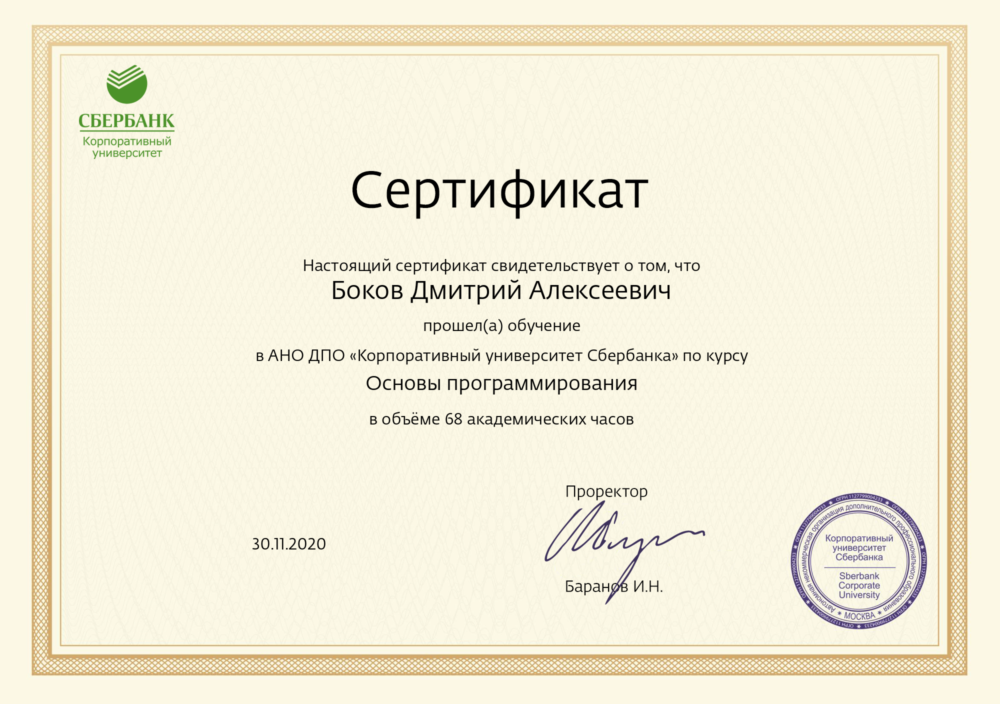
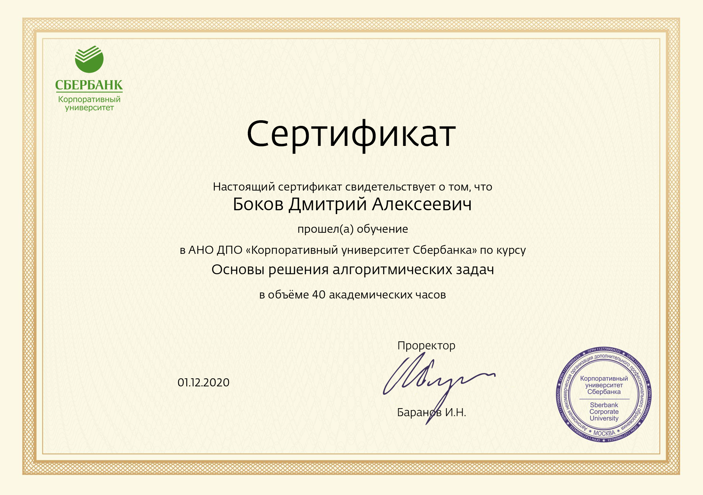
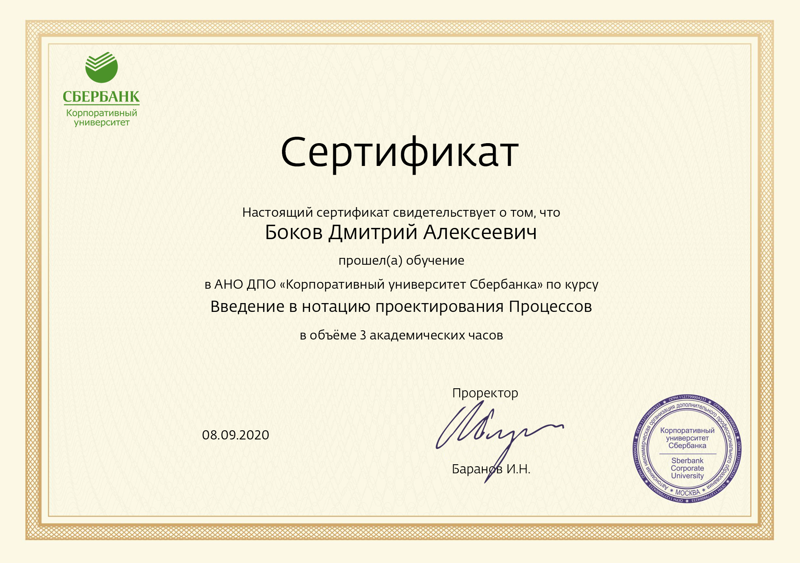
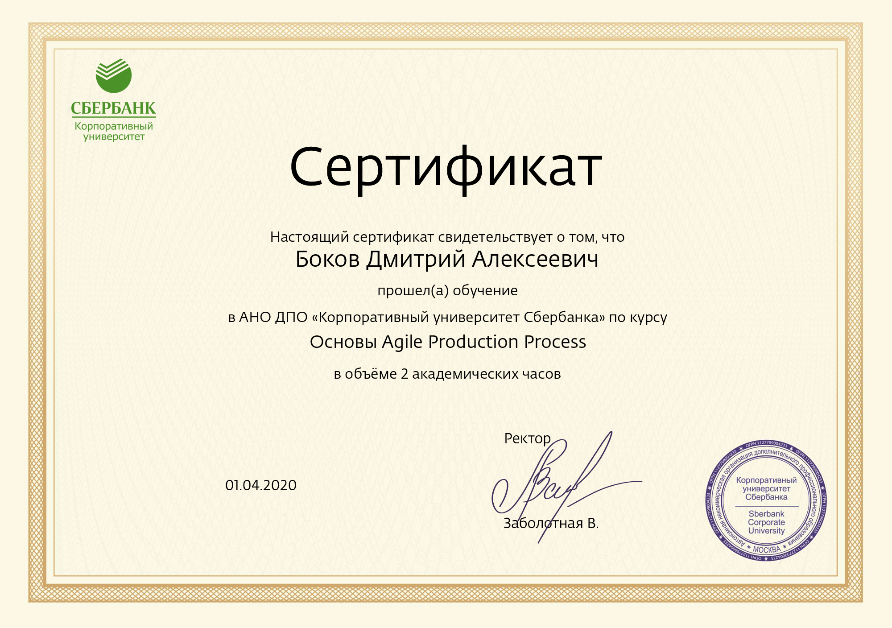
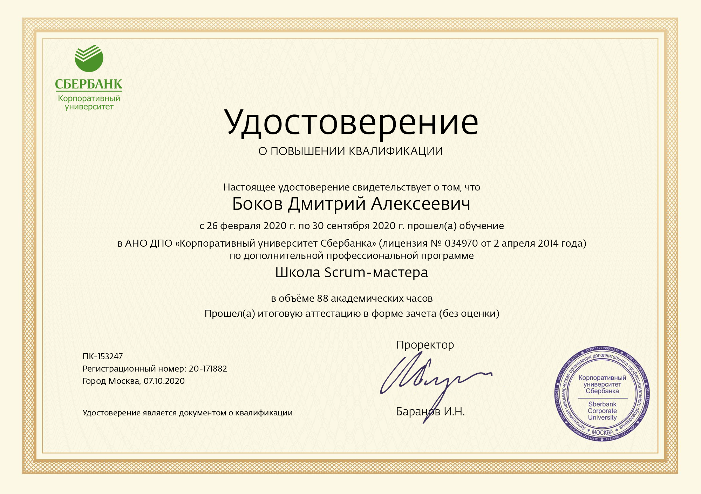
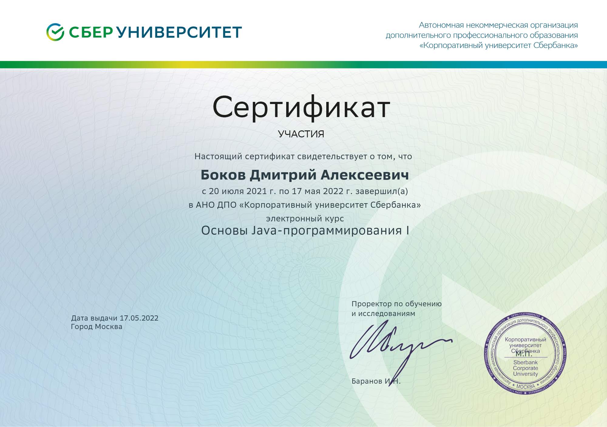
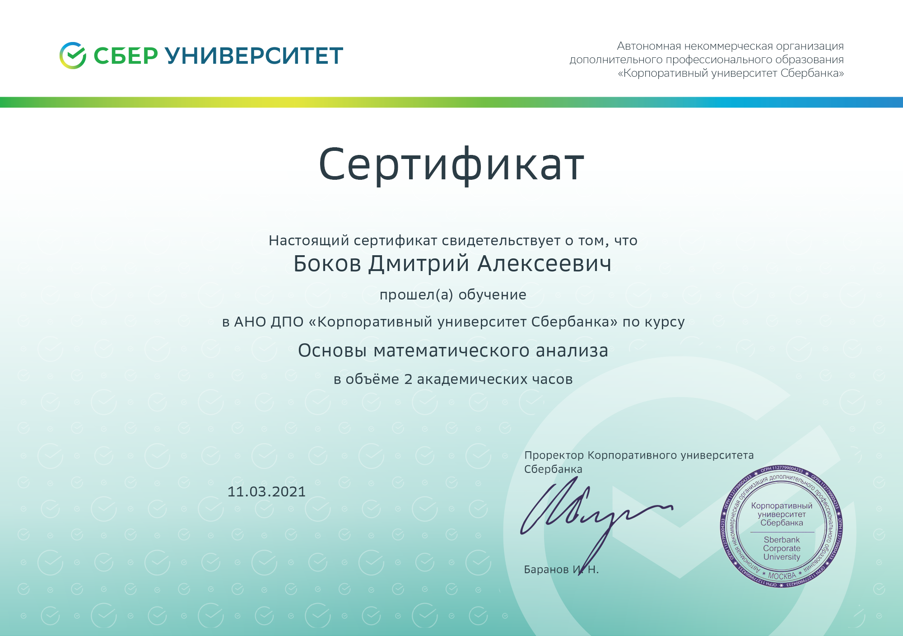
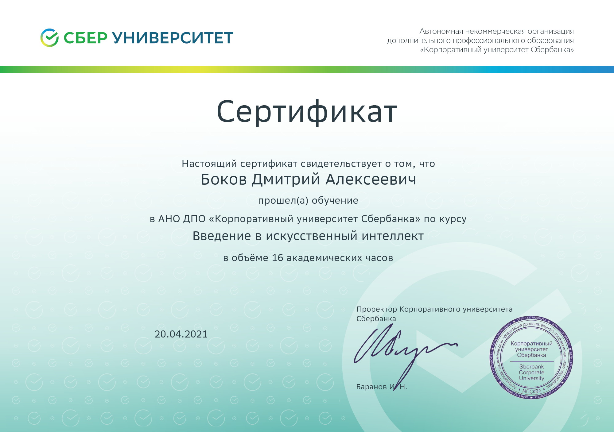
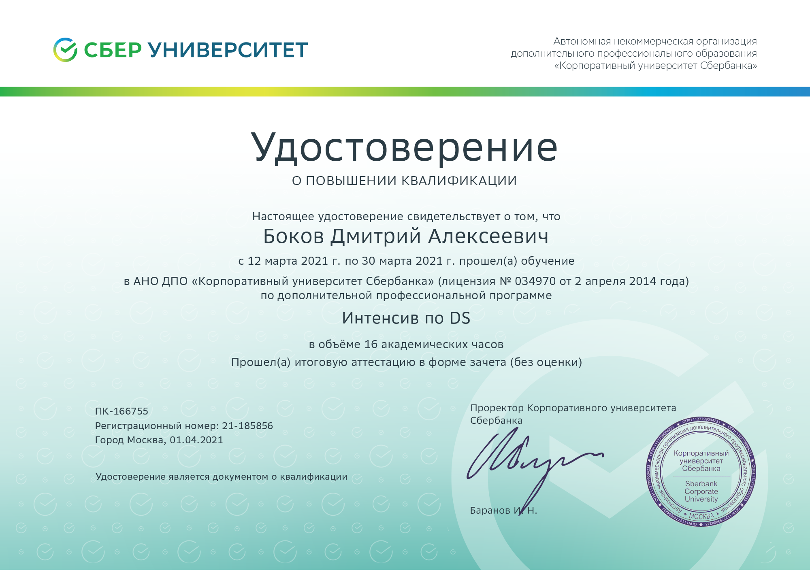
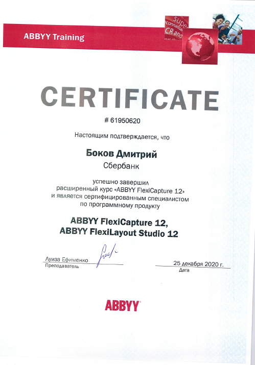

<head>
	<meta name="viewport" content="width=device-width, height=device-height">	
</head>

<body>
	

	<h1>БОКОВ
	 Дмитрий Алексеевич</h1>
	

	
<strong>1. Основные сведения, контакты</strong>

	<table>
	 <tr>
	     <td rowspan="5"></td>
	 </tr>   
	 <tr>
	     <td align="left"><strong>Дата рождения</strong></td>
	     <td align="center">17 июня 1978 г.</td>
	 </tr>
	 <tr>
	     <td align="left"><strong>Место проживания:</strong></td> 
	     <td align="center">город Москва</td>
	 </tr>
	 <tr>
	     <td align="left"><strong>Семейное положение/дети</strong></td>
	     <td align="center">Женат/сын 2012 г.р.</td>
	 </tr>
	 <tr>   
	     <td align="left"><strong>Образование</strong></td>
	     <td align="center">Высшее</td>
	 </tr>
	</table>    

	<strong> Контакты:</strong>

	<table>
	    <tr>
		<td> Телефон</td>
		<td><strong>+7(962) 206-08-44; +7(910) 960-16-96</strong></td>
	    </tr>
	    <tr>
		<td> E-mail</td>
		<td><strong>dmb8637@mail.ru</strong></td>
	    </tr>
	    <tr>
		<td> В интернете</td>
		<td><a HREF="https://dmb8637.github.io/Bokov-Dmitry">Сайт</a></td>
	    </tr>
	    <!--tr>
		<td> В социальных сетях</td>
		<td><a HREF="https://vk.com/id32994005">ВКонтакте</a></td>
	    </tr-->    
	</table>

	<!--table>
	  <tr>
	    <td><a href="документы об образовании-rotated-pages-deleted.pdf" download><small> документы об образовании</small></a></td>
	    <td><a href="anketa_D_A_Bokov.pdf"><small> резюме одним файлом</small></a></td>
	  </tr>
	</table-->

	<ul><strong>ОГЛАВЛЕНИЕ:</strong>
	  <li><a href="#maininfo">1. Основные сведения, контакты</a></li>
	  <li><a href="#mainedu">2. Основное образование</a></li>
	  <li><a href="#inolang">3. Владение иностранными языками</a></li>
	  <li><a href="#exp">4. Опыт работы</a></li>
	  <li><a href="#mainexp">5. Основные навыки по направлениям</a></li>
	  <li><a href="#profess">6. Профессиональная деятельность</a></li>
	  <li><a href="#dopedu">7. Дополнительное образование</a></li>
	  <li><a href="#dopinfo">8. Дополнительная информация</a></li>
	</ul>

	

	 <strong>2. Основное образование</strong>
	 
	<b><strong>Учебное заведение: С(А)ФУ им. М.В. Ломоносова (бывш. АГТУ), г. Архангельск</strong></b>
	 
	<table style="overflow-x:hidden">
	    <tr>
		<td align="center"><strong>Факультет</strong></td>
		<td align="center"><strong>Форма обучения</strong></td>
		<td align="center"><strong>Год поступления и окончания</strong></td>
		<td align="center"><strong>Квалификация</strong></td>
		<!--td align="center"><strong>Специальность</strong></td-->
		<td align="center"><strong>Диплом</strong></td>
	    </tr>
	    <tr>
		<td>Механический</td>
		<td>очная</td>
		<td>1995-2000</td>
		<td>Инженер-механик (с отличием)</td>
		<!--td>Машины и оборудование лесного комплекса</td-->
		<td></td>
	    </tr>    
	    <tr>
		<td>Экономический</td>
		<td>очно-заочная</td>
		<td>1998-2001</td>
		<td>Экономист</td>
		<!--td>Финансы и кредит (специализация «Банковское дело»)</td-->
		<td></td>
	    </tr>    
	    <tr>
		<td>Военная кафедра</td>
		<td>очная</td>
		<td>1998-2000</td>
		<td>Лейтенант запаса (ВУС 101501)</td>
		<!--td>ВУС 101501 (Применение дорожно-строительных и мостостроительных подразделений и частей</td-->
		<td>Военный билет</td>
	    </tr>    
	</table>

	

	 <strong>3. Владение иностранными языками</strong>
	 Английский B1 Intermediate - разговорный уровень.

	

	 <strong>4. Опыт работы</strong>
	 2004-2011
	 - разработка новых, реинжиниринг, рефактринг существующих отчетов и функциональностей для розничного блока банка: открытие, ведение и учет валютных и рублевых счетов и 	депозитов, банковских карт, обезличенных металлических счетов, продажа/покупка монет, ценных бумаг, драгметаллов, лотерейных билетов с использованием ООП RSL (консольные диалоговые окна, структуры БД Pervasive SQL, Oracle Database, SDK)

	 2012-2016
	 - сопровождение розницы банка, обеспечение работоспособности, техподдержка СУБД Oracle, фронт-, мидл- и бэкофисных систем

	 2017-2018
	 - сопровождение учетно-статистических систем, аналитическая работа с Big Data, Data Mining, Teradata. Отмеченные достижения - разработка комплекса инструментов (Data Mining) для учета, анализа и прогнозирования территориального размещения банкоматов и терминалов самообслуживания

	 2019-2020
	 - разработка инструментов учета залоговых активов (приложение "Залоговый портфель" -  VBA, VBS, MS Access, MSSQL-TSQL). Отмеченные достижения - разратка комплекса роботизированного инструмента для автоматической диспетчеризации задач залогового центра (Blue Prizm, VBS, C#)

	 2021-2022
	 - разработка, внедрение, доработка существующего и создание нового функционала для распознавания документов (структурированных и неструктурированных) с применением ABBYY Flexicapture, Tesseract, ML-моделей. Использование библиотек и фреймворков по работе с компьютерным зрением (OpenCV). Применение инструментов для анализа больших данных Numpy и Pandas
	 - разработка приложений для роботизиованного функционала (распознавание экранных образов, маршрутизация действий ПК, эмуляция действий пользователя - OpenCV, C#)
	 - тестирование, GUI-автоматизация, Selenium
	 - применение Jenkins, GIT для обесечения непрерывной интеграции ПО
	 - OpenShift, контейнеризация, микросервисы
	 - верстка диалоговых форм, страниц сайтов, фреймов для клиентов (JS, JQ, HTML, CSS, media) - фриланс

	

	 <strong>5. Основные навыки по направлениям</strong>
	 <small>нажимайте на указатель для развертывания</small>
	

		

			
Программирование

			

				Опыт программирования на HTML, CSS, JavaScript(JQuery), С#, Python, VB. Верстка сайтов. Микросервисная архитектура(Red Hat OpenShift);
	   Основы программирования 
	   Основы решений алгоритмических задач 
	   Проектирование процессов 
	   Agile 
	   Scrum-школа 
	   Java 
			

		
	
		

			
СУБД и анализ данных

			

				Cвод и анализ больших объемов данных с использованием PL/SQL, TransactSQL, TERADATA, Python Pandas.
				Сопровождение, обновление и развертывание СУБД (MsSQL, ORACLE Database, TERADATA), использование аналитических 				инструментов (OLAP-КУБ, QlikView);
	   Математический анализ 
			

		

		

			
Нейросети, машинное обучение, искусственный интеллект

			

				Работа с нейросетями, распознавание образов и текста(ABBYY FC12, tesseract, open cv), машинное обучение. Участие в семинарах, а также личное 				увлечение вопросами машинного обучения, BIG DATA.
	   Введение в искусственный интеллект 
	   Data Science, Python(pandas, numpy) 
	   ABBYY FC 
			

		

		

			
Банковские фронт-, мидл- и бэк-офисные системы

			

				Администрирование программного обеспечения розничного блока (АС Филиал, АС Филиал-сбербанк, RS-Retail, АС ЦОД), информационно-платежные терминалы (ProSet), банковские карты (POS-терминалы);
			

		

		

			
Роботизация

			

				Роботизация бизнес-процессов;
	   RPA Blue Prizm 
			

		

		

			
Реализованные проекты

			

				  <ul><li>Участие в проекте ПАО Сбербанк “Витрины устройств самообслуживания”, непосредственное участие в разработке (кластерный анализ точек соприкосновения УС) в сентябре 2017 года. Создание математической модели по фомированию Витрины УС.</li>
	  <li>Участие в проекте ПАО Сбербанк “Автоматическая диспетчеризация распределения задач залоговой службы”, непосредственное участие в разработке (RPA) в июне 2019 года.</li>
	  <li>Проект АС "Залоговый портфель". Доработка инструмента. 2018 год. </li></ul>
			

		

		

			
Коммуникации

			

				Семинары по технике продаж, комплекс тренингов “Мастерская бизнес-коммуникаций”, “Навыки личной эффективности”, участие в управленческих поединках и т.д.);
			

		

	
	

	

	 <strong>6. Профессиональная деятельность (в обратном хронологическом порядке)</strong>
	 
	<table style="overflow-x:hidden">
	    <tr>
		<td align="center"><strong>Организация</strong></td>
		<td align="center"><strong>Начало и окончание</strong></td>
		<td align="center"><strong>Должность</strong></td>
		<!--td align="center"><strong>Кратко задачи</strong></td-->
	    </tr>    
	    <tr>
		<td>ПАО Сбербанк г. Москва</td>
		<td>октябрь 2019 – май 2022</td>
		<td>Эксперт Дивизиона "Развитие внешнеэкономического партнерства" Корпоративно-инвестиционный бизнес</td>
		<!--td></td-->
	    </tr>    
	    <tr>
		<td>ПАО Сбербанк г. Москва</td>
		<td>декабрь 2018 – сентябрь 2019</td>
		<td>Ведущий специалист Центра залоговой экспертизы</td>
		<!--td></td-->
	    </tr>    
	    <tr>
		<td>ПАО Сбербанк г. Ярославль</td>
		<td>июль 2018 – ноябрь 2018</td>
		<td>ассистент клиентского менеджера Управления крупного и среднего бизнеса</td>
		<!--td></td-->
	    </tr>    
	    <tr>
		<td>ПАО Сбербанк г. Москва</td>
		<td>май 2017 – июнь 2018</td>
		<td>менеджер Управления планирования и управления</td>
		<!--td></td-->
	    </tr>    
	    <tr>
		<td>ПАО Сбербанк г. Ярославль</td>
		<td>февраль 2016 - май 2017</td>
		<td>менеджер по качеству и технологической поддержке Управления платежных сервисов</td>
		<!--td></td-->
	    </tr>    
	    <tr>
		<td>ОАО Сбербанк России г. Ярославль</td>
		<td>2007 – февраль 2016</td>
		<td>инженер, ведущий инженер Управления автоматизации</td>
		<!--td></td-->
	    </tr>    
	    <tr>
		<td>ОАО Сбербанк России г. Архангельск</td>
		<td>2004 – 2007</td>
		<td>инженер, старший инженер Управления автоматизации</td>
		<!--td></td-->
	    </tr> 
	    <tr>
		<td>ОАО Сбербанк России г. Архангельск</td>
		<td>2001 – 2004</td>
		<td>Контролер, контролер-кассир, старший контролер</td>
		<!--td></td-->
	    </tr> 
	</table>    

	

	 <strong>7. Дополнительное образование, курсы повышения квалификации, семинары, тренинги</strong>
	 
	<table style="overflow-x:hidden">
	<tr>
	    <td align="center"><strong>Наименование программы, курсов</strong></td>
	    <td align="center"><strong>Период обучения</strong></td>
	    <td align="center"><strong>Организатор</strong></td>
	    <td align="center"><strong>Сертификат</strong></td>
	</tr>
	<tr>
	    <td>Oracle Database 10g: SQL Fundamentals I и II</td>
	    <td>2008</td>
	    <td>КАМИ учебный центр</td>
	    <td></td>
	</tr>
	<tr>    
	    <td>ISO20000 – Implementation (стандарт процессов управления услугами ИТ)</td>
	    <td>2008</td>
	    <td>British Standards Institution</td>
	    <td></td>
	</tr>    
	<tr>
	    <td>Практика внедрения процессов планирования, согласования и совершенствования качества ИТ-сервисов на основе ITIL</td>
	    <td>2008</td>
	    <td>British Standards Institution</td>
	    <td></td>
	</tr>
	<tr>
	    <td>тренинг “Мастерская бизнес-коммуникаций”</td>
	    <td>2018</td>
	    <td>ПАО Сбербанк</td>
	    <td></td>
	</tr>
	<tr>
	    <td>тренинг “Навыки личной эффективности”</td>
	    <td>2017</td>
	    <td>ПАО Сбербанк</td>
	    <td></td>
	</tr>
	<tr>
	    <td>Семинар по технике продаж</td>
	    <td>2018</td>
	    <td>ПАО Сбербанк</td>
	    <td></td>
	</tr>
	<tr>
	    <td>Семинар “Блокчейн”</td>
	    <td>2018</td>
	    <td>ПАО Сбербанк</td>
	    <td></td>
	</tr>
	<tr>
	    <td>Семинар “BIG DATA, машинное обучение”</td>
	    <td>2018</td>
	    <td>ПАО Сбербанк</td>
	    <td></td>
	</tr>
	<tr>
	    <td>Тренинги Р.Гандапаса, тема - “Лидерство”</td>
	    <td>2018</td>
	    <td>самостоятельно</td>
	    <td></td>
	</tr>
	<tr>
	    <td>Создание, сопровождения сайтов</td>
	    <td>2018</td>
	    <td>самостоятельно</td>
	    <td></td>
	</tr>
	</table>    

	

	 <strong>8. Дополнительная информация</strong>
	
Исполнителен, трудолюбив, пунктуален, аккуратен. Умею работать в команде. Клиентоориентирован. Легко обучаем, настойчив. Есть большое желание работать и развиваться. Есть рекомендательное письмо с последнего места работы.

	 <a href="#maininfo">Наверх</a>
</body>
