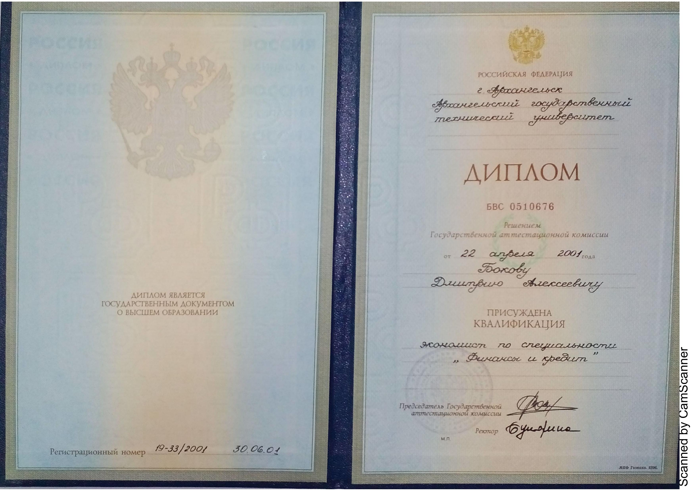

<head><link rel = "stylesheet" href = "css/styles.css"></head>

<h1>БОКОВ
 Дмитрий Алексеевич</h1>

<small>обновлено 04-02-2020 12:47</small>

<small>Кликайте на изображения для увеличения </small>

<strong>Краткая информация:</strong>
  Дата рождения: 17 июня 1978 г.
  Место проживания: г.Москва
  Семейное положение/дети: Не женат/сын 2012 г.р.
  Образование: высшее
  <strong> Контакты:</strong>
   Телефон: <strong>+7(962) 206-08-44; +7(910) 960-16-96</strong>
   E-mail: <strong>dmb8637@mail.ru</strong>
   В интернете: <a HREF="https://dmb8637.github.io/Bokov-Dmitry">Сайт</a>
   В социальных сетях: <a HREF="https://vk.com/id32994005">ВКонтакте</a>

<!--***********************************************************-->
<table>
  <tr>
    <td><a href="документы об образовании-rotated-pages-deleted.pdf" download> документы об образовании</a></td>
    <td><a href="anketa_D_A_Bokov.pdf"> резюме одним файлом</a></td>    
  </tr>
</table>
<!--***********************************************************-->
<ul><strong>ОГЛАВЛЕНИЕ:</strong>
  <li><a href="#maininfo">1.Основные сведения, контакты</a></li>
  <li><a href="#mainedu">2.Основное образование</a></li>
  <li><a href="#inolang">3.Владение иностранными языками</a></li>
  <li><a href="#mainexp">4.Основные достижения</a></li>
  <li><a href="#profess">5.Профессиональная деятельность</a></li>
  <li><a href="#dopedu">6.Дополнительное образование</a></li>
  <li><a href="#dopinfo">7.Дополнительная информация</a></li>
</ul>
<!--***********************************************************-->

 <strong>2. ОСНОВНОЕ ОБРАЗОВАНИЕ:</strong>
 
<ul>
  <li><b>Учебное заведение: С(А)ФУ им. М.В. Ломоносова (бывш. АГТУ), г. Архангельск</b>
  <ul>
   <li><i>Механический факультет, очная форма</i>
     <ul>    
       <li>Год поступления и окончания: 1995-2000</li>
       <li>Квалификация: Инженер-механик (диплом с отличием)</li>
       <li>Специальность: Машины и оборудование лесного комплекса
        </li>
     </ul>    
   </li>
  <li><i>Экономический факультет, очно-заочная форма</i>
   <ul>    
     <li>Год поступления и окончания: 1998-2001</li>
     <li>Квалификация: Экономист</li>
     <li>Специальность: Финансы и кредит (специализация «Банковское дело»)
      </li>
   </ul>    
  </li>
  <li><i>Военная кафедра, очная форма</i>
   <ul>    
     <li>Год поступления и окончания: 1998-2000</li>
     <li>Воинское звание: Лейтенант запаса (военный билет)</li>
     <li>Специальность: ВУС 101501 (Применение дорожно-строительных и мостостроительных подразделений и частей</li>
   </ul>    
  </li>
</ul>
</li>
<!--***********************************************************-->

 <strong>3. Уровень владения иностранным языком</strong>
 Английский B1 Intermediate - разговорный уровень.
<!--***********************************************************-->

 
  <strong>4. Основные достижения:</strong>
  
<ul>
  <li>Участие в семинарах, а также личное увлечение вопросами машинного обучения, BIG DATA. Есть опыт программирования на HTML, С++, С#, Python, VBA;</li>
  <li>Cвод и анализ больших объемов данных по операциям физических лиц с использованием PL/SQL, TransactSQL, TERADATA;</li>
  <li>Сопровождение, обновление и развертывание СУБД (MsSQL, ORACLE Database, TERADATA), использование аналитических инструментов (OLAP-КУБ, QlikView);</li>
  <li>Работа с нейросетями, распознавание образов и текста, машинное обучение; </li>
  <li>Роботизация бизнес-процессов (RPA Blue Prizm);
   </li>
  <li>Администрирование программного обеспечения розничного блока (АС Филиал, АС Филиал-сбербанк, RS-Retail, АС ЦОД), информационно-платежными терминалами (ProSet), банковскими картами (POS-терминалы);</li>
  <li>Семинары по технике продаж, комплекс тренингов “Мастерская бизнес-коммуникаций”, “Навыки личной эффективности”, участие в управленческих поединках и т.д.);</li>
  <li>Участие в проекте ПАО Сбербанк “Витрины устройств самообслуживания”, непосредственное участие в разработке (кластерный анализ) в сентябре 2017 года.</li>
  <li>Участие в проекте ПАО Сбербанк “Автоматическая диспетчеризация распределения задач залоговой службы”, непосредственное участие в разработке (RPA) в июне 2019 года.</li>
</ul>  
<!--***********************************************************-->

 <strong>5. ПРОФЕССИОНАЛЬНАЯ ДЕЯТЕЛЬНОСТЬ</strong>
  
 <strong>6 - Организация: ПАО Сбербанк г. Москва</strong>
 <ul>
  <li>Начало и окончание: октябрь 2019 – н.в.</li>
  <li>Должность: Эксперт Дивизиона "Развитие внешнеэкономического партнерства" Корпоративно-инвестиционный бизнес</li>
 </ul>
 <strong>5 - Организация: ПАО Сбербанк г. Москва</strong>
 <ul>
  <li>Начало и окончание: декабрь 2018 – сентябрь 2019</li>
  <li>Должность: Ведущий специалист Центра залоговой экспертизы</li>
 </ul>
 <strong>4 - Организация: ПАО Сбербанк г. Ярославль</strong>
 <ul>
  <li>Начало и окончание: июль 2018 – ноябрь 2018</li>
  <li>Должность: ассистент клиентского менеджера Управления крупного и среднего бизнеса</li>
 </ul>
 <strong>3 - Организация: ПАО Сбербанк г. Москва</strong>
 <ul>
  <li>Начало и окончание: май 2017 – июнь 2018</li>
  <li>Должность: менеджер Управления планирования и управления</li>
 </ul>
 <strong>2 - Организация: ПАО Сбербанк г. Ярославль</strong>
 <ul>
  <li>Начало и окончание: февраль 2016 - май 2017</li>
  <li>Должность: менеджер по качеству и технологической поддержке Управления платежных сервисов</li>
 </ul>
 <ul>
  <li>Начало и окончание: 2007 – февраль 2016</li>
  <li>Должность: инженер, ведущий инженер Управления автоматизации</li>
 </ul>
 <strong>1 - Организация: ОАО Сбербанк России г. Архангельск</strong>
 <ul>
  <li>Начало и окончание: 2004 – 2007</li>
  <li>Должность: инженер, старший инженер Управления автоматизации</li>
 </ul>
 <ul>
  <li>Начало и окончание: 2001 – 2004</li>
  <li>Должность: Контролер, контролер-кассир, старший контролер</li>
 </ul>
 <!--***********************************************************-->

 <strong>6. Дополнительное образование, курсы повышения квалификации, семинары, тренинги</strong>
 
 Наименование программы, курсов: Oracle Database 10g: SQL Fundamentals I и II
 Период обучения: 2008
 Организатор: КАМИ учебный центр
 
 
 Наименование программы, курсов: ISO20000 – Implementation (стандарт процессов управления услугами ИТ)
 Период обучения: 2008
 Организатор: British Standards Institution
 
 
 Наименование программы, курсов: Практика внедрения процессов планирования, согласования и совершенствования качества ИТ-сервисов на основе ITIL
 Период обучения: 2008
 Организатор: British Standards Institution
 
 
 Наименование программы, курсов: тренинг “Мастерская бизнес-коммуникаций”
 Период обучения: 2018
 Организатор: ПАО Сбербанк
 
 Наименование программы, курсов: тренинг “Навыки личной эффективности”
 Период обучения: 2017
 Организатор: ПАО Сбербанк
 
 Наименование программы, курсов: Семинар по технике продаж
 Период обучения: 2018
 Организатор: ПАО Сбербанк
 
 Наименование программы, курсов: Семинар “Блокчейн”
 Период обучения: 2018
 Организатор: ПАО Сбербанк
 
 Наименование программы, курсов: Семинар “BIG DATA, машинное обучение”
 Период обучения: 2018
 Организатор: ПАО Сбербанк
 
 Наименование программы, курсов: Тренинги Р.Гандапаса, тема - “Лидерство”
 Период обучения: 2018
 Организатор:
 
 Наименование программы, курсов: создание, сопровождения сайтов
 Период обучения: 2018
 Организатор: самостоятельно
 
 <!--***********************************************************-->

 <strong>7. ДОПОЛНИТЕЛЬНАЯ ИНФОРМАЦИЯ</strong>

Исполнителен, трудолюбив, пунктуален, аккуратен. Умею работать в команде. Клиентоориентирован. Легко обучаем, настойчив. Есть большое желание работать и развиваться.

